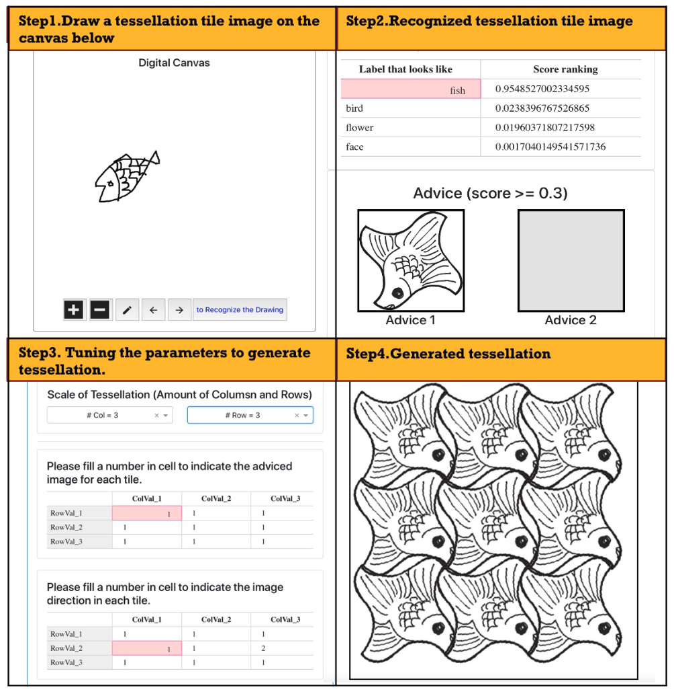

# Design of Tessellation Tiles

[TOC]

## 1) Introduction

* This project is a part of the work "Computer-Supported Design of Tessellation Tiles Based on Recognition of Drawings"
  * Support for the internal design of tessellation
    * Recommendation of tessellation tile images to users based on the classification of user's drawing
  * Support for the external design of tessellation
    * Generation of tessellation by combining the tessellation tiles

* List of Contributors

  ```
  * Luyi Huang
  * With best thanks to other collaborators in the following work:
  ```

  

## 3) How to start (for developers)


### 3.1) Initialization of Python Environment

* (1) Please get Miniconda (latest version right for your OS) installed: https://docs.conda.io/en/latest/miniconda.html

* (2) Create a virtual environment named TessDrawing, and then activate it

```bash
# here we use python 3.7 because the system is currently only tested on this version
conda create env tessellation-design python=3.7

# to activate the newly created miniconda environment
conda activate tessellation-design
```
* (3) Install the package manager "poetry" using command ```pip```, and then use command ```poetry``` to install packages listed in file ```pyproject.toml```

```bash
$ pip install poetry
$ poetry install
```


### 3.2) Place the data

* Download the experiment data, then unzip it and put it in the project root folder

```
data                                                # the foler where keeping all the data
├── cases
│   └── case_3                                      # case id
│       ├── advice                                  # folder to place the categorized images for advice
│       │   ├── bird
│       │   ├── face
│       │   ├── fish
│       │   └── flower
(tessellation) image
│       ├── conf                                    # keeping the config file (configuring the model and advice) for this test case
│       └── model                                   # the folder keeping the model
│           ├── cat4_cv5_idx2.20200802_213207       # one model trained based on Neural Network Console
│           │   └── export_report
│           └── shape_20200926_171018               # another model trained based on Neural Network Console
│               └── export_report
└── logs                                            # list of log files
```


### 3.3) Run

* (4) to start the model interface
```bash
# to start the model interface
./run_model_interface.py
```
* (5) to start the web interface
```bash
# to start the web interface
./run_web_interface.py
# Note: since this system is still under development, you may see some warning in the log during run
```
* Demo Page

  


## 4) Extra Information

* Copyrights

  * Citation [1]

    ```
    Luyi HUANG, Shigaku TEI, Yilang WU, Hisao SHIIZUKA, A Support System for Artful Design of Tessellations Drawing using CNN and CG. International Journal of Affective Engineering. 2021, Vol.20, No.2, p.95.
    DOI: https://doi.org/10.5057/ijae.IJAE-D-20-00022
    ```

  * Citation [2]

    ```
    Luyi Huang, Zixue Cheng, Yilang Wu, A rule-based computer support for the design of tessellation tiles, Displays, 2022, 102141, ISSN 0141-9382,
    DOI: https://doi.org/10.1016/j.displa.2021.102141.
    ```

* Package Dependency

```
| Name                      | Version     | License                                                          | URL                                                                       |
|---------------------------|-------------|------------------------------------------------------------------|---------------------------------------------------------------------------|
| Brotli                    | 1.0.9       | MIT License                                                      | https://github.com/google/brotli                                          |
| Cython                    | 0.29.21     | Apache Software License                                          | http://cython.org/                                                        |
| Flask                     | 1.1.2       | BSD License                                                      | https://palletsprojects.com/p/flask/                                      |
| Flask-Compress            | 1.5.0       | MIT License                                                      | https://github.com/colour-science/flask-compress                          |
| Flask-RESTful             | 0.3.8       | BSD License                                                      | https://www.github.com/flask-restful/flask-restful/                       |
| Jinja2                    | 2.11.2      | BSD License                                                      | https://palletsprojects.com/p/jinja/                                      |
| Keras-Applications        | 1.0.8       | MIT License                                                      | https://github.com/keras-team/keras-applications                          |
| Keras-Preprocessing       | 1.1.2       | MIT License                                                      | https://github.com/keras-team/keras-preprocessing                         |
| Markdown                  | 3.2.2       | BSD License                                                      | https://Python-Markdown.github.io/                                        |
| MarkupSafe                | 1.1.1       | BSD License                                                      | https://palletsprojects.com/p/markupsafe/                                 |
| Pillow                    | 7.2.0       | Historical Permission Notice and Disclaimer (HPND)               | https://python-pillow.org                                                 |
| PyWavelets                | 1.1.1       | MIT License                                                      | https://github.com/PyWavelets/pywt                                        |
| PyYAML                    | 5.3.1       | MIT License                                                      | https://github.com/yaml/pyyaml                                            |
| Werkzeug                  | 1.0.1       | BSD License                                                      | https://palletsprojects.com/p/werkzeug/                                   |
| XlsxWriter                | 1.3.4       | BSD License                                                      | https://github.com/jmcnamara/XlsxWriter                                   |
| absl-py                   | 0.10.0      | Apache Software License                                          | https://github.com/abseil/abseil-py                                       |
| aniso8601                 | 8.0.0       | BSD License                                                      | https://bitbucket.org/nielsenb/aniso8601                                  |
| astor                     | 0.8.1       | BSD License                                                      | https://github.com/berkerpeksag/astor                                     |
| boto3                     | 1.15.6      | Apache Software License                                          | https://github.com/boto/boto3                                             |
| botocore                  | 1.18.6      | Apache Software License                                          | https://github.com/boto/botocore                                          |
| certifi                   | 2020.6.20   | Mozilla Public License 2.0 (MPL 2.0)                             | https://certifiio.readthedocs.io/en/latest/                               |
| chardet                   | 3.0.4       | GNU Library or Lesser General Public License (LGPL)              | https://github.com/chardet/chardet                                        |
| click                     | 7.1.2       | BSD License                                                      | https://palletsprojects.com/p/click/                                      |
| configparser              | 5.0.0       | MIT License                                                      | https://github.com/jaraco/configparser/                                   |
| contextlib2               | 0.6.0.post1 | Python Software Foundation License                               | http://contextlib2.readthedocs.org                                        |
| cycler                    | 0.10.0      | BSD                                                              | http://github.com/matplotlib/cycler                                       |
| dash                      | 1.16.1      | MIT License                                                      | https://plotly.com/dash                                                   |
| dash-bootstrap-components | 0.10.6      | Apache Software License                                          | https://dash-bootstrap-components.opensource.faculty.ai                   |
| dash-canvas               | 0.1.0       | MIT                                                              | https://github.com/plotly/dash-canvas                                     |
| dash-core-components      | 1.12.1      | MIT                                                              | UNKNOWN                                                                   |
| dash-html-components      | 1.1.1       | MIT                                                              | https://github.com/plotly/dash-html-components                            |
| dash-renderer             | 1.8.1       | MIT                                                              | UNKNOWN                                                                   |
| dash-table                | 4.10.1      | MIT                                                              | UNKNOWN                                                                   |
| decorator                 | 4.4.2       | BSD License                                                      | https://github.com/micheles/decorator                                     |
| future                    | 0.18.2      | MIT License                                                      | https://python-future.org                                                 |
| gast                      | 0.2.2       | BSD License                                                      | https://github.com/serge-sans-paille/gast/                                |
| google-pasta              | 0.2.0       | Apache Software License                                          | https://github.com/google/pasta                                           |
| grpcio                    | 1.32.0      | Apache Software License                                          | https://grpc.io                                                           |
| h5py                      | 2.10.0      | BSD License                                                      | http://www.h5py.org                                                       |
| idna                      | 2.10        | BSD License                                                      | https://github.com/kjd/idna                                               |
| imageio                   | 2.9.0       | BSD License                                                      | https://github.com/imageio/imageio                                        |
| itsdangerous              | 1.1.0       | BSD License                                                      | https://palletsprojects.com/p/itsdangerous/                               |
| jmespath                  | 0.10.0      | MIT License                                                      | https://github.com/jmespath/jmespath.py                                   |
| joblib                    | 0.16.0      | BSD License                                                      | https://joblib.readthedocs.io                                             |
| jsonpatch                 | 1.26        | BSD License                                                      | https://github.com/stefankoegl/python-json-patch                          |
| jsonpointer               | 2.0         | BSD License                                                      | https://github.com/stefankoegl/python-json-pointer                        |
| jupyter-core              | 4.6.3       | BSD License                                                      | https://jupyter.org                                                       |
| kiwisolver                | 1.2.0       | BSD                                                              | https://github.com/nucleic/kiwi                                           |
| lxml                      | 4.5.2       | BSD License                                                      | https://lxml.de/                                                          |
| matplotlib                | 3.3.2       | Python Software Foundation License                               | https://matplotlib.org                                                    |
| natsort                   | 7.0.1       | MIT License                                                      | https://github.com/SethMMorton/natsort                                    |
| networkx                  | 2.5         | BSD License                                                      | http://networkx.github.io/                                                |
| nnabla                    | 1.11.0      | Apache Software License                                          | https://github.com/sony/nnabla                                            |
| numpy                     | 1.19.2      | BSD                                                              | https://www.numpy.org                                                     |
| onnx                      | 1.7.0       | UNKNOWN                                                          | https://github.com/onnx/onnx                                              |
| opt-einsum                | 3.3.0       | MIT                                                              | https://github.com/dgasmith/opt_einsum                                    |
| pandas                    | 1.1.2       | BSD                                                              | https://pandas.pydata.org                                                 |
| plotly                    | 4.10.0      | MIT                                                              | https://plotly.com/python/                                                |
| ppt                       | 0.0.6       | License :: OSI Approved :: Apache Software License               | http://www.seba1511.com                                                   |
| protobuf                  | 3.13.0      | 3-Clause BSD License                                             | https://developers.google.com/protocol-buffers/                           |
| pyparsing                 | 2.4.7       | MIT License                                                      | https://github.com/pyparsing/pyparsing/                                   |
| python-dateutil           | 2.8.1       | BSD License, Apache Software License                             | https://dateutil.readthedocs.io                                           |
| python-pptx               | 0.6.18      | The MIT License (MIT)                                            | http://github.com/scanny/python-pptx                                      |
| pytz                      | 2020.1      | MIT License                                                      | http://pythonhosted.org/pytz                                              |
| pyzmq                     | 19.0.2      | GNU Library or Lesser General Public License (LGPL), BSD License | https://pyzmq.readthedocs.org                                             |
| requests                  | 2.24.0      | Apache Software License                                          | https://requests.readthedocs.io                                           |
| retrying                  | 1.3.3       | Apache Software License                                          | https://github.com/rholder/retrying                                       |
| s3transfer                | 0.3.3       | Apache Software License                                          | https://github.com/boto/s3transfer                                        |
| scikit-image              | 0.17.2      | BSD License                                                      | https://scikit-image.org                                                  |
| scikit-learn              | 0.23.2      | new BSD                                                          | http://scikit-learn.org                                                   |
| scipy                     | 1.5.2       | BSD License                                                      | https://www.scipy.org                                                     |
| six                       | 1.15.0      | MIT License                                                      | https://github.com/benjaminp/six                                          |
| tensorboard               | 1.15.0      | Apache Software License                                          | https://github.com/tensorflow/tensorboard                                 |
| tensorflow                | 1.15.3      | Apache Software License                                          | https://www.tensorflow.org/                                               |
| tensorflow-estimator      | 1.15.1      | Apache Software License                                          | https://www.tensorflow.org/                                               |
| termcolor                 | 1.1.0       | MIT License                                                      | http://pypi.python.org/pypi/termcolor                                     |
| threadpoolctl             | 2.1.0       | BSD License                                                      | https://github.com/joblib/threadpoolctl                                   |
| tifffile                  | 2020.9.3    | BSD License                                                      | https://www.lfd.uci.edu/~gohlke/                                          |
| torchfile                 | 0.1.0       | BSD                                                              | https://github.com/bshillingford/python-torchfile                         |
| tqdm                      | 4.50.0      | MIT License, Mozilla Public License 2.0 (MPL 2.0)                | https://github.com/tqdm/tqdm                                              |
| typing-extensions         | 3.7.4.3     | Python Software Foundation License                               | https://github.com/python/typing/blob/master/typing_extensions/README.rst |
| urllib3                   | 1.25.10     | MIT License                                                      | https://urllib3.readthedocs.io/                                           |
| visdom                    | 0.1.8.9     | CC-BY-NC-4.0                                                     | https://github.com/facebookresearch/visdom                                |
| websocket-client          | 0.57.0      | BSD License                                                      | https://github.com/websocket-client/websocket-client.git                  |
```
